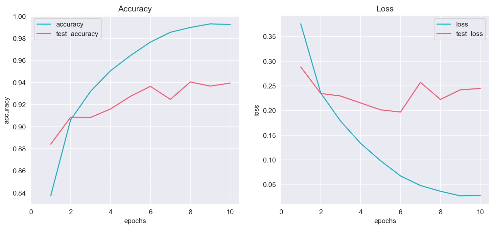
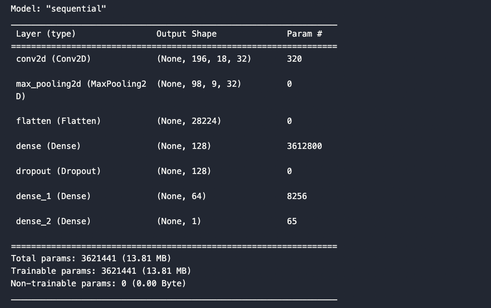

# AMP ConvNet Model Summary

TensorFlow and Keras Deep Convolutional Neural Network (ConvNet) that identifies Antimicrobial Peptides (AMPs) based on Amino Acid Sequences.

## Table of Contents

- [Model structure](#model-structure)
- [Optimisations](#optimisations)
- [Analysis of model](#analysis-of-model)
- [Future optimisations](#future-optimisations)

## Model structure

- The original model was built as follows:

  1. `Convolutional 2D Input Layer` with `relu` activation and `198, 20, 1` input shape.

  2. `Max-Pooling Layer` with pool size of `2, 2`.

  3. `Flatten Layer`.

  4. `Dense Layer` with `relu` activation.

  5. `Dense Output Layer` with `sigmoid` activation.

- Compiled Model with `binary_crossentropy` loss handling and `adam` optimizer using `accuracy` as metric.

- Trains and Tests the Model with `epochs = 10`.

- **Model performance (overfitting)**:

  

- As shown by `test_loss`, the model was overfitting the training data. As such, the model was optimised further.

## Optimisations

- Optimised model:

  1. `Convolutional 2D Input Layer` with `relu` activation and `198, 20, 1` input shape.

  2. `Max-Pooling Layer` with pool size of `2, 2`.

  3. `Flatten Layer`.
  4. `Dense Layer` with `relu` activation.
  5. **added** `Dropout Layer` with `0.5` as parameter.

  4. **added** `Dense Layer` with `relu` activation.

  5. `Dense Output Layer` with `sigmoid` activation.

- Compiled Model with `binary_crossentropy` loss handling and `adam` optimizer using `accuracy` as metric.

- Trains and Tests the Model with `epochs = 5`.

- **Simplified Lenet Diagram**:

  

- **Model structure**:

  

- **Optimised model performance**:

  

- **Confusion matrix**:

  

- **Classification report**:

  

## Analysis of model

- Overall, the model is reasonably well balanced as indicated by similar precision and recall scores for both AMP and Non-AMP classes.
- While an accuracy of `85%` is quite good, there is room for improvement. 

## Future optimisations

- Increasing the size and diversity of the training data.
- Ensemble models would perhaps offer the greatest performance increase to the model.
  - Use unbinned (current) and binned amino acid models simultaneously.
    - Bin amino acids according to physical and chemical properties (eg. Murphy 8 or 10, hydrophobicity etc.)
- Carefully tune Hyperparameters such as learning rate.
- Try different Loss Functions and Metrics.
- Experiment with more Model Architectures (add layers, increase/decrease epochs etc.)